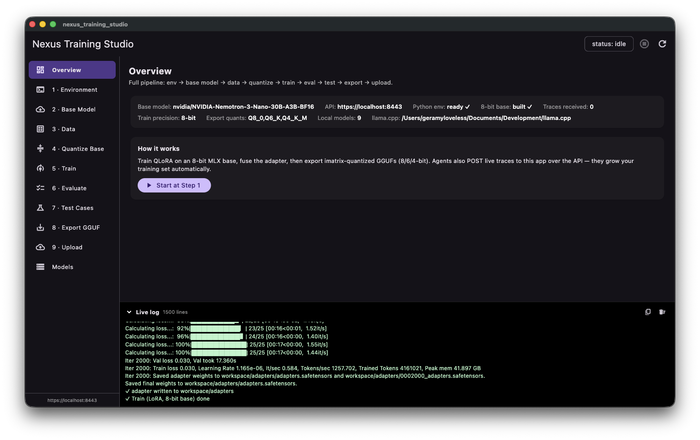
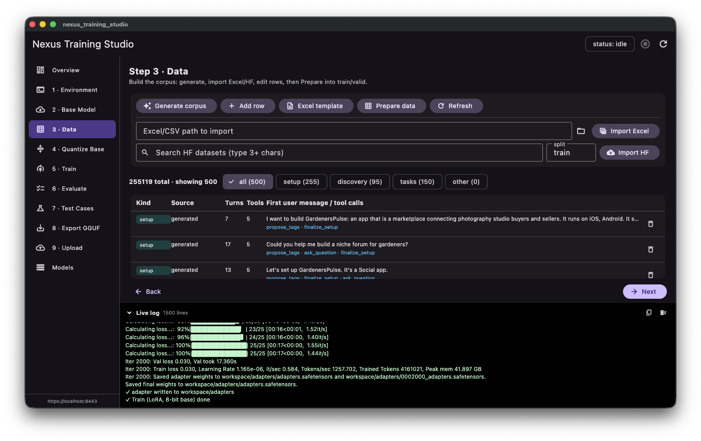
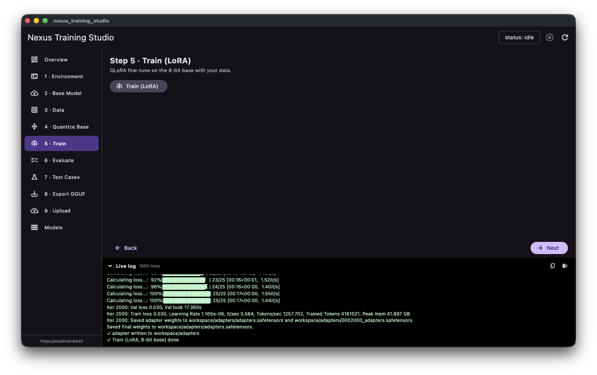
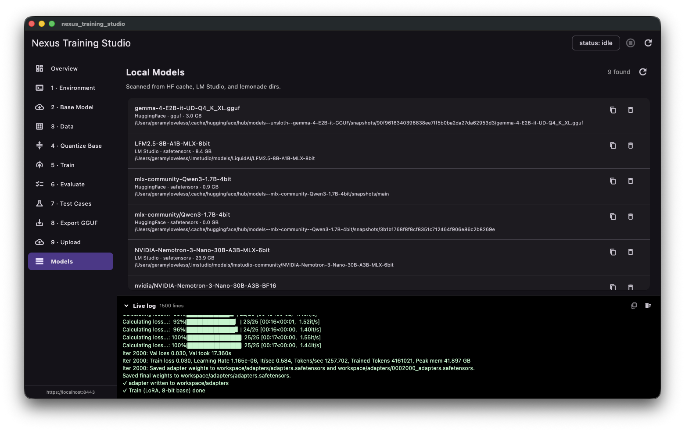

# Nexus Training Studio

A macOS app to **fine-tune a tool-calling model for the Nexus agents and export it as GGUF** —
LoRA training on Apple Silicon (MLX), all from a guided UI. It also runs a local HTTPS API so
the agents (or you) can feed training data and drive the whole pipeline.



## What it does

Walk left-to-right through the steps; each runs locally and streams to the live-log dock:

**Environment → Base Model → Data → Quantize → Train → Evaluate → Test → Export GGUF → Upload**

- **Generate / import data** — synthesize tens of thousands of tool-calling conversations
  (setup interview, discovery, task generation), or import Excel/CSV and Hugging Face datasets.
- **Train** — QLoRA on an 8-bit MLX base of a 30B hybrid-MoE model (attention + MLP targets).
- **Export** — fuse the adapter → GGUF, imatrix-quantized to Q8/Q6/Q4 for llama.cpp / lemonade.
- **Upload** — push models to Hugging Face (your account or an org), public or private.

| Data table — generate / import / edit | Train (LoRA), live loss |
|---|---|
|  |  |

## Quick start

Requirements: **macOS on Apple Silicon**, [Flutter](https://docs.flutter.dev/get-started/install/macos),
Python 3, and a built [llama.cpp](https://github.com/ggml-org/llama.cpp) (for GGUF export).

```bash
flutter run -d macos          # launch the app
```

Then in the app, top-to-bottom:
1. **Step 1 — Setup env** (creates a Python venv + installs mlx-lm).
2. **Step 2 — Base Model** — paste a Hugging Face token, search + download a model.
3. **Step 3 — Data** — *Generate corpus* (or import Excel/HF), then *Prepare data*.
4. **Step 4–5** — *Quantize 8-bit*, then *Train (LoRA)*.
5. **Step 8 — Export GGUF**, **Step 9 — Upload**.

Edit `config.yaml` to set the base model, `llama.cpp` path, and export quants.

## API

The app serves `https://localhost:8443` (self-signed). Agents POST conversation traces to
`/training-data`; the whole pipeline is drivable over HTTP — `POST /run/<step>`, `GET /data`,
`GET /status`, `GET /logs` — so it can run headless while you watch the UI.



## Output

GGUF quants ready for llama.cpp / lemonade. ⚠️ The base is a **reasoning model** — serve it with
**thinking disabled** (`enable_thinking=false`) and parse the `<function=…>` tool-call format.
See the exported model card for details.
